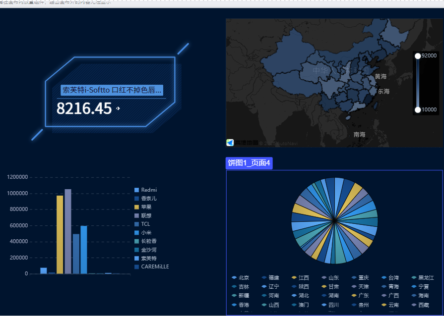
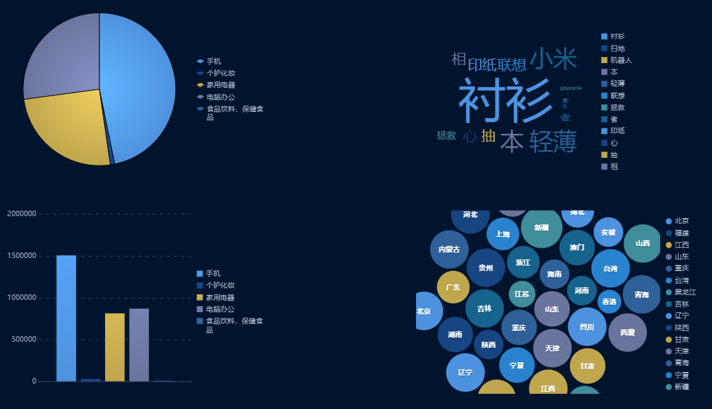

## 报表展示

> 图1： spu的总销售额轮播图，根据dws层的DwsSkuOrder表，对每个spu的销售额分别汇总。
> DwsSkuOrder表是通过将dwd层的order_info_order_detail宽表，
> 又聚合并join一系列维度表得到的汇总表

> 图2：各省份的总下单金额热力图，根据dws层的DwsProvinceOrder表，
> 对每个省份的销售额分别汇总，DwsProvinceOrder表是通过将dwd层的
> order_info_order_detail宽表，又关联省份维度表得到的汇总表

> 图3：每个品牌的总销售额柱状图，算法同1

> 图4：每个省份下单次数饼图，算法同2

> 图5、图7：1 2类标签的销售额统计，算法同1

> 图6：搜索关键字次数的词云图，上游数据是埋点log日志，
> 将page日志中的item通过ik分词器进行拆分，得到搜索关键字，然后再进行计数。得到汇总数据

> 图8：各省份下单次数气泡图，算法同2