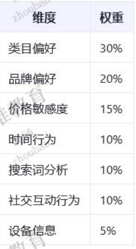

## 1.年龄
> 埋点日志
> 业务表：收藏，加购，订单，付款，评价
> 用户表 存在有效数据则直接进行处理，没有有效数据则进行加权判断
> 根据c1进行类目偏好 tm进行品牌偏好 od.order_price进行价格敏感度
> 下单时间进行时间行为统计 搜索词用keyword进行分析 设备信息用log日志的数据进行分析
> 权重

## 2.性别
> 埋点日志
## 3.年代
> 同年龄

## 4.身高
## 5.体重
## 6.星座

