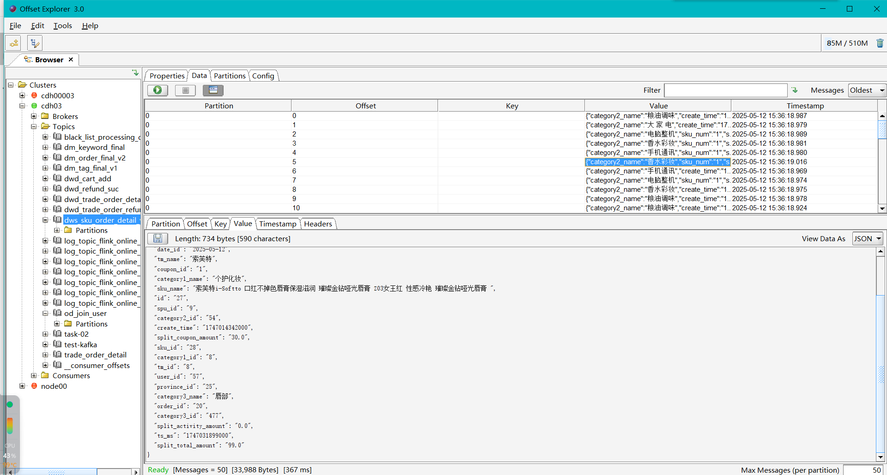
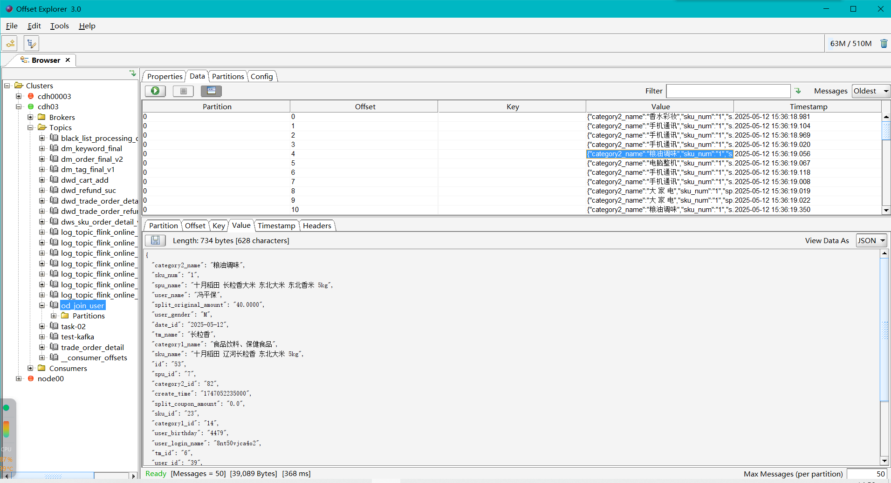
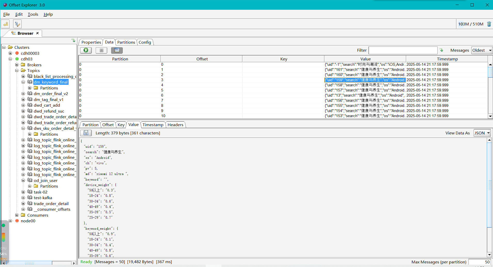
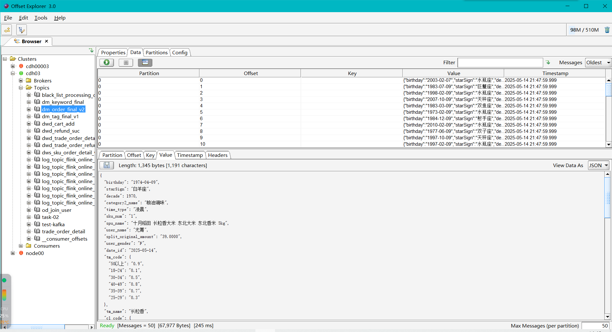
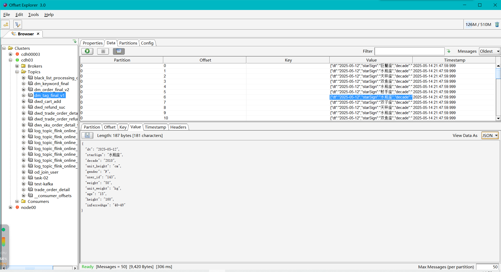
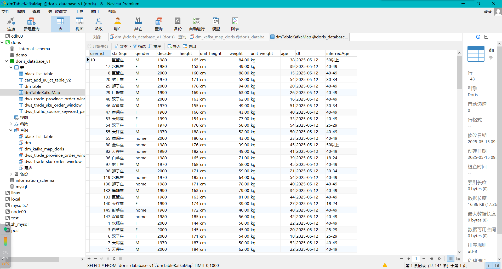

## 数据源：
### kafka:
        dm_order_final_v2: <-od_join_user<-dws_sku_order_detail_v1
        <-dwd_trade_order_detail_v1(DwdTradeOrderDetail)
        <- log_topic_flink_online_v1_dwd(DimToHbase)
        <-log_topic_flink_online_v1(CdcSinkToKafka)

        dm_keyword_final: <-log_topic_flink_online_v1_log(flume)
### mysql:
        online_flink_retail.user_info_sup_msg

后续产生的主题
## od_join_user

## dm_key_word

## dm_order_detail

## dm_final_tag

## dorisTable

难点 1. 加权重
    2. 根据权重计算年龄段

优化点 
    1.权重写入hbase  
    2.异步io简化 提前将表连接然后写入hbase 形成sku直接对接类目和品牌的表 方便链接
    3.kafka数据映射到doris